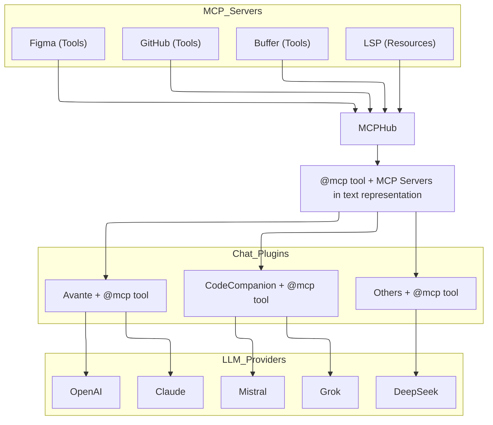

# MCP Hub

#### Supercharge Neovim with MCP server integrations for seamless coding and LLM workflows.

[](https://www.lua.org)
[](https://nixos.org)
[](https://opensource.org/licenses/MIT)
[](https://discord.gg/NTqfxXsNuN)

A powerful Neovim plugin that integrates MCP (Model Context Protocol) servers into your workflow. Configure and manage MCP servers through a centralized config file while providing an intuitive UI for browsing, installing and testing tools and resources. Perfect for LLM integration, offering both programmatic API access and interactive testing capabilities through the `:MCPHub` command.

**Discord**: Join our [Discord server](https://discord.gg/NTqfxXsNuN) for discussions, help, and updates



<details open>
<summary><strong>MCPHub in Action</strong></summary>
<div>
<p>
<h4>MCPHub + <a href="https://github.com/yetone/avante.nvim">Avante</a> + Figma </h4>
<video controls muted src="https://github.com/user-attachments/assets/e33fb5c3-7dbd-40b2-bec5-471a465c7f4d"></video>
</p>
</div>

<details>
<summary>Built-in Marketplace</summary>
<p>
<h4>🎉 Marketplace </h4>
<video controls muted src="https://github.com/user-attachments/assets/20a18abc-f2ba-436e-aab7-ea795f6e28d2"></video>
</p>
</details>

<details>
<summary>Seamless Integration with CodeCompanion</summary>
<p>
<h4>Using <a href="https://github.com/olimorris/codecompanion.nvim">CodeCompanion</a></h4>
<video controls muted src="https://github.com/user-attachments/assets/cefce4bb-d07f-4423-8873-cf7d56656cd3"></video>
</p>
</details>
</details>

# Quickstart

## 📋 Requirements

<ul>
<li>Node version should be >= 18.0.0</li>
<li>Neovim version should be >= 0.8.0</li>
<li>Plenary.nvim (for HTTP requests)</li>
<li>mcp-hub  (automatically installed via build command)</li>
</ul>

## 📦 Installation

Using [lazy.nvim](https://github.com/folke/lazy.nvim):

```lua
{
    "ravitemer/mcphub.nvim",
    dependencies = {
      "nvim-lua/plenary.nvim",  -- Required for Job and HTTP requests
    },
    -- uncomment the following line to load hub lazily
    --cmd = "MCPHub",  -- lazy load
    build = "npm install -g mcp-hub@latest",  -- Installs required mcp-hub npm module
    -- uncomment this if you don't want mcp-hub to be available globally or can't use -g
    -- build = "bundled_build.lua",  -- Use this and set use_bundled_binary = true in opts  (see Advanced configuration)
    config = function()
      require("mcphub").setup()
    end,
}
```

## 🚀 Basic Usage

Open the MCPHub UI to manage servers, test tools and monitor status:

```vim
:MCPHub
```

<details>
<summary>For Chat plugin Devs: Use hub instance api in your code</summary>

```lua
local hub = mcphub.get_hub_instance()

-- Call a tool (sync)
  local response, err = hub:call_tool("server-name", "tool-name", {
      param1 = "value1"
      }, {
      return_text = true -- Parse response to LLM-suitable text
      })

-- Call a tool (async)
  hub:call_tool("server-name", "tool-name", {
      param1 = "value1"
      }, {
      return_text = true,
      callback = function(response, err)
      -- Use response
      end
      })

-- Access resource (sync)
  local response, err = hub:access_resource("server-name", "resource://uri", {
      return_text = true
      })

-- Get prompt helpers for system prompts
local prompts = hub:generate_prompts()
-- prompts.active_servers: Lists currently active servers
-- prompts.use_mcp_tool: Instructions for tool usage with example
-- prompts.access_mcp_resource: Instructions for resource access with example
```

</details>

## ⚙️ Advanced Configuration

<details>
<summary>Default Config</summary>

All options are optional with sensible defaults. Here's a complete example with all available options:

```lua
require("mcphub").setup({
    port = 37373, -- Default port for MCP Hub
    config = vim.fn.expand("~/.config/mcphub/servers.json"), -- Absolute path to config file location (will create if not exists)
    native_servers = {}, -- add your native servers here

    auto_approve = false, -- Auto approve mcp tool calls
    auto_toggle_mcp_servers = true, -- Let LLMs start and stop MCP servers automatically
    -- Extensions configuration
    extensions = {
        avante = {
            make_slash_commands = true, -- make /slash commands from MCP server prompts
        },
        codecompanion = {
            show_result_in_chat = true, -- Show the mcp tool result in the chat buffer
            make_vars = true, -- make chat #variables from MCP server resources
            make_slash_commands = true, -- make /slash commands from MCP server prompts
        },
    },


    -- Default window settings
    ui = {
        window = {
            width = 0.8, -- 0-1 (ratio); "50%" (percentage); 50 (raw number)
            height = 0.8, -- 0-1 (ratio); "50%" (percentage); 50 (raw number)
            relative = "editor",
            zindex = 50,
            border = "rounded", -- "none", "single", "double", "rounded", "solid", "shadow"
        },
        wo = { -- window-scoped options (vim.wo)
        },
    },

    -- Event callbacks
    on_ready = function(hub)
        -- Called when hub is ready
    end,
    on_error = function(err)
        -- Called on errors
    end,

    --set this to true when using build = "bundled_build.lua"
    use_bundled_binary = false, -- Uses bundled mcp-hub script instead of global installation

    --WARN: Use the custom setup if you can't use `npm install -g mcp-hub` or cant have `build = "bundled_build.lua"`
    -- Custom Server command configuration
    --cmd = "node", -- The command to invoke the MCP Hub Server
    --cmdArgs = {"/path/to/node_modules/mcp-hub/dist/cli.js"},    -- Additional arguments for the command
    -- In cases where mcp-hub server is hosted somewhere, set this to the server URL e.g `http://mydomain.com:customport` or `https://url_without_need_for_port.com`
    -- server_url = nil, -- defaults to `http://localhost:port`
    -- Multi-instance Support
    shutdown_delay = 600000, -- Delay in ms before shutting down the server when last instance closes (default: 10 minutes)

    -- Logging configuration
    log = {
        level = vim.log.levels.WARN,
        to_file = false,
        file_path = nil,
        prefix = "MCPHub",
    },
})
```

</details>

<details>
<summary>Servers.json</summary>

MCPHub uses a JSON configuration file to define MCP servers. The default location is `~/.config/mcphub/servers.json`.

#### Example Configuration

```js
{
  "mcpServers": {
    "fetch": {
      "command": "uvx",
      "args": ["mcp-server-fetch", "$API_KEY"], //replaces $API_KEY with API_KEY from env field
      "env": {
        "API_KEY": "",                 // Falls back to process.env.API_KEY
        "SERVER_URL": null,            // Falls back to process.env.SERVER_URL
        "AUTH_HEADER": "BEARER ${API_KEY}", // ${API_KEY} is replaced with resolved value of API_KEY in the env field falling back to process.env
        "DEBUG": "true"               // Direct value, no fallback
      }
    },
    "remote-server": {
      "url": "https://api.example.com/mcp", // Auto determine streamable-http or sse, Auto OAuth authorization
      "headers": {                          // Explicit headers
        "Authorization": "Bearer ${API_KEY}" // ${API_KEY} is replaced with process.env.API_KEY
      }
    }
  }
}
```

Configuration file (`~/.config/mcphub/servers.json`) is watched for changes and updates are applied automatically in real-time across all Neovim instances.

</details>

### 🔧 MCP Servers Configuration

`mcphub.nvim` supports two types of MCP (Modular Code Processing) servers:

<details><summary>🖥️ <b>Local (Stdio) MCP Servers</b></summary>
Use this when the MCP server runs locally and communicates via standard input/output.

##### Required:

- `command`:  
  The executable or script that launches your MCP server.  
  Example: `"node"` or `"python3"`

##### Optional:

- `args`:  
  An array of arguments passed to the command.  
  Supports env variable replacement for arguments starting with `$`.

- `env`:  
   Custom environment variables. Special cases:
  - `""` (empty string) → Uses `process.env.[VAR_NAME]`
  - `null` → Also falls back to `process.env.[VAR_NAME]`
  - Any other value is used **as-is**
  </details>
  <details><summary>🌐 <b>Remote (HTTP/SSE-based) Servers</b></summary>
  Use this for servers accessible over the network using **SSE** (Server-Sent Events) or **streamable HTTP**.

##### Required:

- `url`:  
  Remote MCP server endpoint.
  - Auto-detects the protocol (`streamable-http` or `sse`)
  - Handles OAuth authentication automatically if needed

##### Optional:

- `headers`:  
 Custom HTTP headers (e.g., Authorization tokens, Content-Type, etc.)
</details>

<br>
Both local and remote servers support additional options:

- `disabled`: Disable this server
- `disabled_tools`: Exclude specific tools from the server
- `custom_instructions`: Provide custom behavior instructions for the server

These options can also be updated conveniently via the built-in UI.

## 🔌 Extensions

MCPHub.nvim provides extensions that integrate with popular Neovim chat plugins. These extensions allow you to use MCP tools and resources directly within your chat interfaces.

<details>
<summary>
Avante.nvim
</summary>

Add MCP capabilities to Avante by including the MCP tools in your setup:

> Set `config.auto_approve = true` or `vim.g.mcphub_auto_approve = true` to automatically approve mcp tool requests.

> Set `config.extensions.avante.make_slash_commands = true` to enable prompts as slash commands (enabled by default).
> Server prompts will be available as `/mcp:server_name:prompt_name` in chat.

The `mcp_tool()` function now returns two separate tools (`use_mcp_tool` and `access_mcp_resource`) for better schema generation:

```lua
require("mcphub").setup({
    extensions = {
        avante = {
            make_slash_commands = true, -- make /slash commands from MCP server prompts
        }
    }
})
```

```lua
require("avante").setup({
    -- other config
    -- The system_prompt type supports both a string and a function that returns a string. Using a function here allows dynamically updating the prompt with mcphub
    system_prompt = function()
        local hub = require("mcphub").get_hub_instance()
        return hub:get_active_servers_prompt()
    end,
    -- The custom_tools type supports both a list and a function that returns a list. Using a function here prevents requiring mcphub before it's loaded
    custom_tools = function()
        return {
            require("mcphub.extensions.avante").mcp_tool(),
        }
    end,
})
```

⚠️ **Tool Conflicts**: [Disable any built-in Avante tools](https://github.com/yetone/avante.nvim#disable-tools) that might conflict with enabled MCP servers to prevent duplicate functionality or unexpected behavior.

If you are using the builtin Neovim server, you might have to disable the following tools in your avante config to avoid any conflicts.

```lua
disabled_tools = {
    "list_files",
    "search_files",
    "read_file",
    "create_file",
    "rename_file",
    "delete_file",
    "create_dir",
    "rename_dir",
    "delete_dir",
    "bash",
},
```

</details>

<details>
<summary>
CodeCompanion
</summary>

Add MCP capabilities to CodeCompanion.

> Set `config.auto_approve = true` or `vim.g.mcphub_auto_approve = true` to automatically approve tool requests.

> Set `make_vars = true` to show resources as #variables in the chat buffer

> Set `make_slash_commands = true` to show prompts as /slash_commands in the chat buffer

- Type @mcp in the chat (once submitted, it will add available MCP Servers to the system prompts and adds a tool so that the LLM can call tools, resources on MCP Servers etc)
- Server prompts become available as `/mcp:prompt_name` slash commands in chat (_Currently very few servers provide prompts, but you can add your own using `mcphub.add_prompt`_)
- Prompts with arguments are handled using vim.ui.input (cancelling input for required arguments will abort the slash command)
- If the last message from the `/mcp:prompt_name` message is of `user` role, it will be added to the chat buffer.

* Whenever the servers are updated, the variables and slash_commands will also be updated in realtime
  

* E.g LSP current file diagnostics
  


> Set `show_result_in_chat = true` to view the mcp tool call result in the chat buffer.

```lua

require("mcphub").setup({
    extensions = {
        codecompanion = {
            -- Show the mcp tool result in the chat buffer
            show_result_in_chat = true,
            make_vars = true, -- make chat #variables from MCP server resources
            make_slash_commands = true, -- make /slash_commands from MCP server prompts
        },
    }
})
```

```lua
require("codecompanion").setup({
    strategies = {
        chat = {
            tools = {
                ["mcp"] = {
                    -- calling it in a function would prevent mcphub from being loaded before it's needed
                    callback = function() return require("mcphub.extensions.codecompanion") end,
                    description = "Call tools and resources from the MCP Servers",
                }
            }
        }
    }
})

```

</details>

<details>
<summary>
Lualine
</summary>

```lua
require('lualine').setup {
    sections = {
        lualine_x = {
            {require('mcphub.extensions.lualine')},
        },
    },
}
```

When connecting show warning state.


When idle shows total number of connected servers.


When a tool or resources is being called, shows spinner.


</details>

---

## 🚧 Whats Coming Next

- ✅ Neovim MCP Server (kind of) with better editing, diffs, terminal integration etc (Ideas are welcome)
- ✅ Enhanced help view with comprehensive documentation
- ✅ MCP Resources as variables in chat plugins
- ✅ MCP Prompts as slash commands in chat plugins
- ✅ Enable LLM to start and stop MCP Servers dynamically
- ✅ Support SSE transport
- ✅ Support /slash_commands in avante
- ✅ Support streamable-http transport
- ✅ Support OAuth
- 🕒 Support #variables in avante
- 🕒 Better Docs and Wiki
- ❌ ~Composio Integration~
- ❌ ~Smithery Integration~

## 📚 Documentation

For detailed documentation, visit our [Wiki](https://github.com/ravitemer/mcphub.nvim/wiki):

- [Installation Guide](https://github.com/ravitemer/mcphub.nvim/wiki/Installation)
- [Configuration Guide](https://github.com/ravitemer/mcphub.nvim/wiki/Configuration-File)
- [Extension Setup](https://github.com/ravitemer/mcphub.nvim/wiki/Extensions)
- [Avante Integration](https://github.com/ravitemer/mcphub.nvim/wiki/Avante)
- [CodeCompanion Integration](https://github.com/ravitemer/mcphub.nvim/wiki/CodeCompanion)
- [Lualine Integration](https://github.com/ravitemer/mcphub.nvim/wiki/Lualine)
- [Native MCP Servers](https://github.com/ravitemer/mcphub.nvim/wiki/Native-Servers)
- [Example Implementations](https://github.com/ravitemer/mcphub.nvim/wiki/Example-Servers)
- [API Reference](https://github.com/ravitemer/mcphub.nvim/wiki/API-Reference)
- [Troubleshooting Guide](https://github.com/ravitemer/mcphub.nvim/wiki/Troubleshooting)

## :raised_hands: Support MCPHub

MCPHub is an open source project that relies on your support. If you like this project, please consider supporting to help maintain and improve the project by [Sponsoring](https://github.com/sponsors/ravitemer) or :coffee: [Buying A Coffee](https://www.buymeacoffee.com/ravitemer)

---

### :purple_heart: Sponsors

Thank you to the following amazing people:

<p align="center">

<a href="https://github.com/yingmanwumen"></a>
<a href="https://github.com/yetone"></a>
<a href="https://github.com/omarcresp"></a>
<a href="https://github.com/petermoser"></a>
<a href="https://github.com/watsy0007"></a>

</p>

---

### 👏 Acknowledgements

Thanks to:

- [cline/mcp-marketplace](https://github.com/cline/mcp-marketplace) for providing the marketplace api
- [nui.nvim](https://github.com/MunifTanjim/nui.nvim) for inspiring our text highlighting utilities
