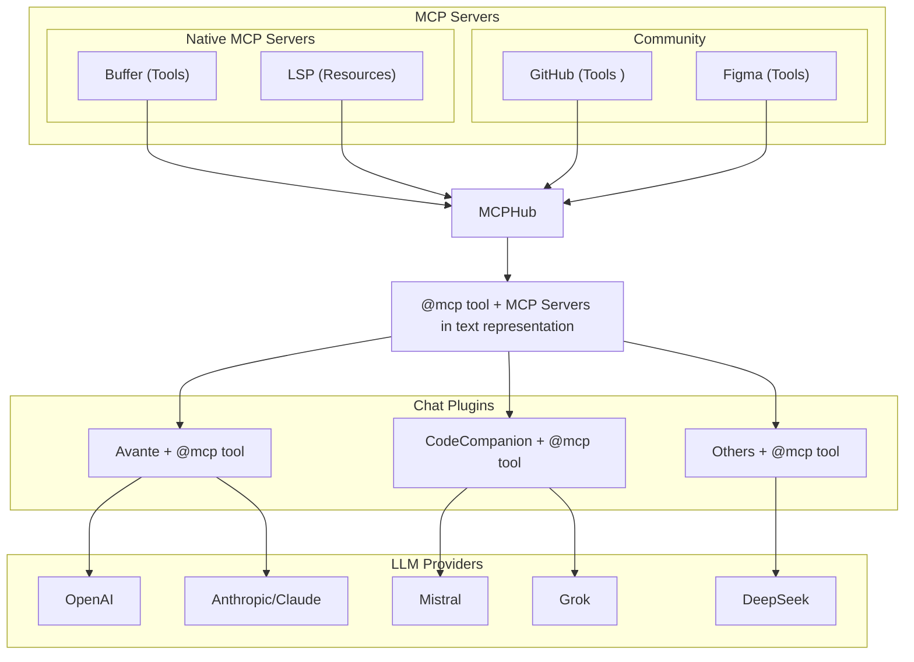

# Why Use Native MCP Servers?



## The Challenge

Many Neovim chat plugins like Avante and CodeCompanion already provide ways to add custom tools:

```lua
-- Avante's custom tools
require("avante").setup({
    custom_tools = {
        get_weather = {
            name,
            description,
            param,
            returns,
            func
        }
    }
})
-- CodeCompanion's tools 
require("codecompanion").setup({
    chat = {
        tools = {
            get_weather = {
                 name,
                 description,
                 cmds,
                 schema,
                 output,
            }
        }
    }
})

```

This leads to several limitations:

| Feature | Regular tools | MCPHub Native Servers |
|---------|-------------------------|----------------------|
| Implementation | Needs reimplementing for each plugin | Write once, works everywhere |
| Api | Needs plugin specific docs | Intuitive chained api `res:text():image():send()` |
| Instructions | Can't have long `schema.description` | Tools,Resources converted to system prompt, instructions in one place |
| Resources Support | No built-in resource handling | Full URI-based resource system |
| Response Types | No standard types | MCP standard types (text, images, blobs) |
| State Management | Per-plugin implementation | Centralized lifecycle management |
| Plugin Updates | May break tool implementations | Tools isolated from plugin changes |

## The MCPHub Solution
MCPHub solves these problems by providing a standardized protocol (MCP) and a central hub for tools and resources:

**MCPHub Native MCP Server**

```lua
-- Complete server definition with tool, resource, and template
{
    name = "weather",
    capabilities = {
        tools = {
            {
                name = "get_weather",
                description = "Get current weather information for a city",
                inputSchema = {
                    type = "object",
                    properties = {
                        city = {
                            type = "string",
                            description = "City name to get weather for",
                        }
                    },
                },
                handler = function(req, res)
                    res:text("Weather in " .. req.params.city .. ": ☀️ Sunny, 22°C"):send()
                end
            }
        },
        resources = {
            {
                name = "current",
                uri = "weather://current/london",
                description = "Get current weather data for London",
                handler = function(req, res)
                    res:text("London: ☀️ Sunny, 22°C, Humidity: 65%"):send()
                end
            }
        },
        resourceTemplates = {
            {
                name = "city_weather",
                uriTemplate = "weather://forecast/{city}",
                description = "Get weather forecast for any city",
                handler = function(req, res)
                    res:text(req.params.city .. " 5-day forecast:\n" ..
                           "Mon: ☀️ 22°C\n" ..
                           "Tue: ⛅ 20°C\n" ..
                           "Wed: 🌧️ 18°C"):send()
                end
            }
        }
    }
}
```

MCPHub acts as a central hub that:
1. **Collects Tools & Resources**: Gathers capabilities from both native and community servers
2. **Standardizes Access**: Provides a single interface via `@mcp` tool
3. **Manages State**: Handles server lifecycles and capability registration
4. **Formats Prompts**: Transforms complex tool definitions into LLM-friendly formats


### Key Benefits

1. **Write Once, Use Everywhere**
   - Implement tools once as native servers
   - Works with any chat plugin that supports MCPHub
   - Chat plugins focus on their unique features

2. **No Limitations**

All tools, resources, and templates from the server above are converted into a clean, LLM-friendly system prompt:

```txt
## weather

### Available Tools
- get_weather: Get current weather information for a city
    Input Schema:
    {
        type: "object",
        properties: {
            city: {
                type: "string",
                description: "City name to get weather for",
                examples: ["London", "Tokyo"]
            }
        }
    }

### Available Resources
- weather://current/london: Get current weather data for London

### Resource Templates
- weather://forecast/{city}: Get weather forecast for any city
```

3. **Rich Resource Capabilities**
   - Static resources with URIs (like weather://current/london)
   - Dynamic resource templates (like weather://forecast/{city})
   - Resource embedding in tool responses
   - Consistent URI patterns across servers
4. **Separation of Concerns**
   - Tool providers focus on implementations
   - Chat plugins focus on LLM integration
   - MCPHub handles communication and standardization

5. **Easy Integration**
   - Chat plugins need only implement MCPHub support
   - Get access to all MCP servers automatically
   - Standardized tool and resource interfaces

6. **Community Ecosystem**
   - Share implementations across plugins
   - Reduce duplication of effort
   - Common platform for tool development
